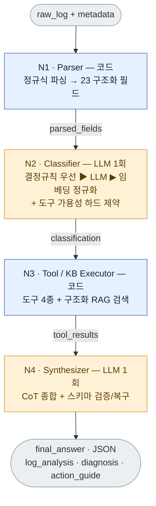

# RAGstar

### RAG 기반 On-Premises OOM 장애 진단 파이프라인
**A RAG-Based On-Premises Pipeline for OOM Fault Diagnosis**

다량의 Linux 커널 OOM 로그를 외부 클라우드 LLM으로 전송하지 않고 사내 폐쇄망 안에서 자동 진단하는 시스템입니다. 로그를 입력하면 **유형 분류 · 근본 원인 · 판단 근거 · 조치 가이드**를 구조화된 JSON으로 반환합니다.

한국정보과학회 **KCC 2026** 학부생 포스터 부문 투고작 · 서강대학교 SW중심대학사업단 산학협력 캡스톤디자인(CSE4186-02).
이 저장소는 진단 엔진을 담당하는 **AI 서버(`ragstar-backend`)** 입니다.

---

## 목차

1. [한눈에 보기](#한눈에-보기)
2. [팀 & 지도교수](#팀--지도교수)
3. [산출물 · 사사](#산출물--사사)
4. [왜 이 프로젝트인가 — 문제 정의](#왜-이-프로젝트인가--문제-정의)
5. [핵심 기여 & 차별점](#핵심-기여--차별점)
6. [시스템 아키텍처](#시스템-아키텍처)
7. [4-Node 파이프라인 상세](#4-node-파이프라인-상세)
8. [동작 예시 (Global OOM)](#동작-예시-global-oom)
9. [지식 베이스(KB)와 평가 데이터셋](#지식-베이스kb와-평가-데이터셋)
10. [실험과 결과](#실험과-결과)
11. [저장소 구조](#저장소-구조)
12. [빠른 시작](#빠른-시작)
13. [기술 스택](#기술-스택)

---

## 한눈에 보기

**OOM(Out-of-Memory)** 은 시스템 전체 또는 특정 cgroup의 가용 메모리가 고갈되어 Linux 커널의 **OOM Killer**가 프로세스를 강제 종료시키는 장애입니다. OOM은 단일 원인이 아니라 **네 가지 유형**으로 나뉘며, 유형마다 근본 원인과 조치가 다릅니다.

| 유형 | 코드 라벨 | 핵심 특징 | 조치 방향 |
| --- | --- | --- | --- |
| cgroup OOM | `cgroup_oom` | 컨테이너/cgroup의 `memory.max` 한계 초과 (K8s에서 가장 흔함) | 한계 상향 · 워크로드 조정 |
| global OOM | `global_oom` | 시스템 전역 물리 메모리 고갈 (`CONSTRAINT_NONE`) | 프로세스 배치 · 메모리 증설 |
| page allocation failure | `page_alloc_failure` | 특정 order의 연속 페이지 할당 실패 (단편화 · zone watermark) | 단편화 완화 · 예약 조정 |
| swap exhaustion | `swap_exhaustion` | RAM + swap이 모두 고갈된 고위험 상태 | swap 확장 · 메모리 누수 점검 |

같은 "OOM"으로 보여도 유형에 따라 처방이 완전히 달라지므로, **비정형 커널 로그에서 정확한 유형을 식별하고 판단 근거(evidence)까지 함께 제시하는 것** 이 진단의 핵심 과제입니다.

RAGstar는 이 과제를 **LangGraph 기반 4단계 상태 그래프(N1→N2→N3→N4)** 로 해결합니다. 설계 원칙은 다음 한 문장으로 요약됩니다.

> **원시 로그를 통째로 LLM에 맡기지 않는다.**
> 파싱·분류·계산·검색 같은 **결정적(deterministic) 단계는 코드**로, **맥락 통합과 자연어 진단만 LLM**으로 분리합니다.
> 이로써 로컬 소형 모델의 부담을 줄이고, 각 단계 출력을 독립적으로 검증할 수 있습니다.

#### 시연 영상

https://github.com/user-attachments/assets/2324d5a2-f05f-433a-b521-43d861fa9d5c

---

## 팀 & 지도교수

서강대학교 SW중심대학사업단 산학협력 캡스톤디자인(CSE4186-02) · 수행기간 2026.03.02 ~ 2026.06.23

**지도교수** — 장두성 교수님 (서강대학교 인공지능학과)

**팀원** — 서강대학교 컴퓨터공학과

| 이름 | 역할 | 주요 기여 |
| --- | --- | --- |
| **강승묵** (팀장) | 시스템 설계 총괄 · 인프라 · 문서 | 전체 구조와 핵심 설계 원칙 확정, 노드 분할 및 코드/LLM 역할 분리·구조화 쿼리 전략 설계, KB 청킹·임베딩 및 ChromaDB 인덱스 구축, vLLM 서빙 전환, 실험 1·2 평가 프로토콜·지표 설계, 논문·보고서·발표자료 작성, 일정·외부 소통 |
| **이규형** | N2·N3 구현 · RAG 연동 | 에이전트 기반 RAG 워크플로우 구축, 도구 분류·실행 모듈 핵심 구현, AI 워커 및 로컬 LLM 서빙 구현, 사용자 입력+메타데이터의 파이프라인 투입 연동, 검색·생성 분리 평가 프레임워크와 임베딩 코사인 유사도 지표 설계, KB 문서 신뢰성 검증·필터링 기준 수립 |
| **박준영** | N1·N4 구현 · 실험 자동화 | OOM 로그 파싱·종합 진단 합성 모듈 구현 및 예외·보정 로직 정비, 실험 2를 base LLM↔RAG·모델 간 비교의 2축 구조로 자동화, 실행 인자·CSV 집계 구현, 회귀 테스트 기반 평가 코드 검증, 추론 서버 및 공통 실행 환경 구성, 발표 포스터 제작 |
| **하지훈** | 데이터 · 웹 · 시연 | 실제 환경에서 OOM 장애를 직접 유발·재현·해결하는 방식으로 56개 평가 로그 데이터셋 수집, 웹 프론트엔드·백엔드 및 사내 운영자용 진단 인터페이스 개발, 시연 구성 |

---

## 산출물 · 사사

**산출물**
- 4단계 LangGraph 기반 OOM 진단 파이프라인 구현체 (`ragstar-backend`)
- OOM 도메인 지식 베이스 — 문서 113건 / 청크 198개
- 평가용 OOM 로그 데이터셋 56건 및 정답(ground truth) 세트
- 모델 규모별·조건별 정량 평가 결과 (Category Match · Evidence Recall · Action Guide Similarity · Recall@K · 지연시간 · VRAM · 비용)
- 학술 논문 1편 — *"RAGstar: A RAG-Based On-Premises Pipeline for OOM Fault Diagnosis"*, 한국정보과학회 KCC 2026 학부생 포스터 부문

**사사** — 본 연구는 2026년 과학기술정보통신부 및 정보통신기획평가원의 AI중심대학사업 지원을 받아 수행되었습니다 (2026-0-00036).

---

## 왜 이 프로젝트인가 — 문제 정의

**1. 데이터 주권 · 보안.** OOM 로그에는 프로세스명·cgroup 경로·커널 버전·메모리 통계 등 인프라 내부 정보가 담깁니다. 금융·공공·국방·의료 등 규제 산업의 폐쇄망에서는 이를 외부 클라우드 LLM API로 전송하는 것이 보안 정책상 금지되므로, 추론이 내부망에서 완결되어야 합니다.

**2. 비정형 로그 진단의 높은 전문성 장벽.** OOM 로그는 zone watermark, GFP flags, cgroup 통계에 대한 이해 없이는 해석이 어렵습니다. 숙련 엔지니어의 수작업에 의존하면 장애 대응 시간(MTTR)이 길어지고 인력 병목이 생깁니다.

**3. 소형 로컬 모델의 실용성에 대한 정량 근거 부재.** 온프레미스에서 현실적으로 운용 가능한 자원은 GPU 1~2장 규모(0.8B~9B급 모델)입니다. 어느 규모 모델이 어느 지표에서 실용 임계를 넘는지를 데이터로 규명할 필요가 있습니다.

**4. 희소 · 고위험 유형의 누락 위험.** `swap_exhaustion`처럼 빈도는 낮지만 영향이 큰 유형은 단순 LLM 호출에서 자주 누락됩니다. RAG가 이런 희소 유형 식별을 개선하는지가 RAG 도입 정당성의 핵심 근거입니다.

---

## 핵심 기여 & 차별점

**56개 OOM 로그 · 198개 KB 청크 · 7개 모델 조건**에서 측정한 결과입니다. (실험 환경: NVIDIA RTX A5000 24GB × 2, vLLM 0.20.1, bf16)

**① 모델 규모와 무관한 분류 일관성.** N2의 결정 규칙 우선 적용으로, OOM 유형 분류 정확도(Category Match)가 0.8B부터 9B까지 전 구간에서 **1.000**으로 동일합니다. 같은 9B를 단일 LLM 호출(Naive)로 돌리면 0.679, GPT-5.2(Naive)는 0.643입니다. OOM 유형이 N1의 결정론적 필드에 드러나고 규칙이 이를 LLM에 앞서 적용하기 때문에 성립하는 구조적 특성입니다.

**② 구조화 쿼리에 의한 검색 회수율 향상.** N1이 추출한 핵심 신호로 쿼리를 재조립하면, 원시 로그를 그대로 임베딩하는 것 대비 **Recall@3이 0.018 → 0.208(×11.6)**, Recall@5가 0.036 → 0.321(×9.0)로 향상됩니다.

**③ 희소 · 고위험 유형 회복.** GPT-5.2를 포함한 모든 Naive 조건이 swap_exhaustion 5건을 놓쳤지만(GPT-5.2 0/5, Qwen 3.5-9B 0/5), RAGstar는 로컬 5개 모델 전부가 **5/5로 식별**했습니다.

**④ 폐쇄망에서의 품질과 비용.** 권장 구성 **Qwen 3.5-9B + RAGstar**는 GPT-5.2(Naive)와 생성 품질 두 지표(Evidence/Guide) 차이가 0.01 이하이고, 쿼리당 비용은 **$0.0008 vs $0.0249**입니다. 동일 모델을 Naive→RAGstar로 전환하면 Evidence Recall **+13.0%**, Action Guide Similarity **+19.2%** 향상됩니다.

**⑤ 소형 모델의 출력 불안정성 흡수.** N4의 schema-repair / fallback 계층 덕분에 **모든 RAG 조건의 error_rate가 0.000**입니다. 0.8B RAG는 첫 시도 JSON 성공률이 0.57로 낮지만 최종 오류는 0입니다.

**⑥ 지연시간.** Qwen 3.5-9B 기준 RAG가 Naive보다 빠릅니다(쿼리당 65.3s vs 164.5s). 구조화된 RAG는 출력 토큰이 적어(1,436 vs 3,661) 응답이 짧고 지연 분산도 작습니다.

#### 관련 연구 대비 위치
네 가지 축(폐쇄망 가동 · OOM 도메인 특화 · KB 기반 조치 생성 · 규칙+LLM 결합)을 모두 만족합니다. (○ 완전 / △ 부분 / × 미지원)

| 시스템 | 폐쇄망 | OOM 특화 | KB 기반 조치 | 규칙+LLM |
| --- | :---: | :---: | :---: | :---: |
| systemd-oomd | ○ | ○ | × | × |
| RCACopilot | × | × | × | △ |
| k8sgpt | △ | × | △ | △ |
| XRAGLog | △ | × | × | × |
| Song & Kim '26 | ○ | × | × | △ |
| **RAGstar (Ours)** | **○** | **○** | **○** | **○** |

---

## 시스템 아키텍처

### 동작 형태 — AI 워커
`ragstar-backend`는 **폴링 기반 AI 워커**로 동작합니다. `worker.py`가 웹 백엔드(`WEB_SERVER_URL`)의 대기 작업을 주기적으로 조회해 OOM 로그를 받아 LangGraph 파이프라인으로 진단하고, 결과 JSON과 중간 산출물(N1~N3)을 백엔드로 제출합니다. 비교용 GPT 베이스라인을 함께 병렬 실행해(`ThreadPoolExecutor`) 결과를 같이 돌려줍니다.

- 작업 큐 인터페이스: `network/web_client.py` — `fetch_pending_task` / `update_task_status` / `submit_result`
- 진단 엔진(LangGraph · vLLM · ChromaDB · Ollama)은 모두 로컬에서 구동되며, **진단 결과 생성에는 외부 API 호출이 없습니다.** 유일한 외부 호출은 성능 비교용 GPT 베이스라인(`baseline/gpt_baseline.py`)으로, `OPENAI_API_KEY`가 설정된 경우에만 진단과 병렬로 실행되고(미설정 시 자동 스킵) 진단 결과 자체에는 관여하지 않습니다.

### 인프라 스택
| 구성요소 | 역할 | 핵심 설정 |
| --- | --- | --- |
| LangGraph | 4단계 상태 그래프 오케스트레이션 | `app/agent/graph.py` (싱글턴 `oom_graph`) |
| vLLM | Chat 추론 엔진 (분류 · 종합 생성) | OpenAI 호환 API, `temperature=0`, `--enforce-eager` |
| Ollama | 임베딩 **전용** | `nomic-embed-text` |
| ChromaDB | 벡터 저장소 | persistent, 컬렉션 `oom_kb` |

> 추론 모델 규모에 따라 텐서 병렬(TP)을 차등 적용합니다 — 0.8B/2B/E2B는 TP=1(단일 GPU), 9B/E4B는 TP=2(이중 GPU). `app/core/vllm_manager.py`의 `ensure_vllm_model()`이 각 진단 실행 전 요청 모델이 서빙 중인지 확인해 정합을 맞춥니다.

### 상태 객체 `OOMState`
노드 사이를 흐르는 단일 상태 딕셔너리입니다. 각 노드는 `{**state, <갱신 키>}` 형태로 불변(immutable) 갱신을 수행합니다. (`app/agent/state.py`)

```python
OOMState = {
    "raw_log":       str,   # 사용자 입력 원문 로그
    "metadata":      dict,  # server_info / service / recent_changes (구조화)
    "metadata_text": str,   # 자유 텍스트 컨텍스트 → N2/N4 프롬프트에 주입
    "parsed_fields": dict,  # N1 출력 (23개 구조화 필드)
    "classification":dict,  # N2 출력 (oom_type, tools_needed, needs_kb, confidence …)
    "tool_results":  dict,  # N3 출력 (도구 4종 결과)
    "diagnosis":     dict,  # N4 출력 (최종 final_answer)
    "error":         str | None,
}
```

---

## 4-Node 파이프라인 상세



> 파란 노드 = 순수 코드(결정론적) · 주황 노드 = LLM 호출(N2·N4, 총 2회). 각 노드는 앞 단계 출력 `parsed_fields → classification → tool_results` 를 받아 다음 노드로 넘깁니다.

### N1 — Parser (구조화 파서)
비정형 dmesg/oom-kill 원시 로그를 **23개 구조화 필드**로 정규화하는 순수 함수 파서입니다. LLM을 쓰지 않습니다.

- **6단계 내부 흐름:** ① 정규화(syslog prefix·`[타임스탬프]` 제거) → ② 이벤트 분할(한 로그에 여러 OOM이 섞일 수 있어 `invoked oom-killer` 기준으로 분리) → ③ 대표 이벤트 선택(실제 kill 라인 우선, 애매하면 정보량 점수 최고 선택) → ④ 그룹별 정규식 추출 → ⑤ 프로세스 테이블 파싱(RSS 내림차순) → ⑥ 일관성 정리
- 각 추출기는 "상세 패턴 → 실패 시 개별 패턴 보완"의 2단 fallback 구조로 다양한 커널 로그 변형을 흡수합니다.
- **필드 그룹(총 23개):** 트리거(`trigger_process` / `gfp_mask` / `order` / `oom_score_adj`) · 종료 프로세스(`killed_process` / `killed_pid` / `total_vm_kb` / `anon_rss_kb`) · 시스템 메모리(`total_ram_pages` / `node_free_kb` / `node_min_kb`) · swap(`swap_total_kb` / `swap_free_kb`) · cgroup(`constraint` / `cgroup_path` / `cgroup_usage_kb` / `cgroup_limit_kb` / `cgroup_failcnt` / `cgroup_swap_usage_kb` / `cgroup_swap_limit_kb` / `cgroup_swap_failcnt`) · `process_table` · `kernel_version`

### N2 — Classifier (유형 분류기)
핵심 설계는 **결정 규칙을 LLM 분류보다 우선 적용**하는 것입니다. 분류 정확성이 LLM 규모에 좌우되지 않습니다.

- **결정 규칙(`deterministic_oom_classification`) — 우선순위 순서:**
  1. `order > 0` → `page_alloc_failure`
  2. `constraint`에 `NONE` 포함 → `global_oom`
  3. `MEMCG` + cgroup swap이 한계까지 소진(`usage == limit > 0`) → `swap_exhaustion`
  4. `MEMCG` 또는 `cgroup_path` 존재 → `cgroup_oom`
  5. 그 외 → `unknown` (이 경우에만 LLM 분류로 폴백)

  > 규칙의 순서 자체가 도메인 지식입니다 — 전역 신호(`CONSTRAINT_NONE`)가 cgroup 신호를 압도한다는 커널 OOM Killer의 판단 위계를 반영합니다.

- **LLM 출력 2단 정규화:** 소형 LLM이 라벨을 자유 형식("Container OOM", "memcg oom")으로 답해도 → ① 별칭 사전으로 즉시 매핑, 실패 시 ② 임베딩 프로토타입 매칭(4개 유형별 프로토타입과 코사인 유사도 비교, 최고 점수가 임계값 `0.62` 이상 & 2위와 마진 `0.08` 이상일 때만 채택). `inspect_embedding_oom_type()`이 best/second 점수·마진·통과 여부를 진단 dict로 남깁니다.
- **도구 가용성 제약:** 데이터가 있어야 도구를 후보에 넣습니다 — `memory_calculator`는 프로세스 테이블 ≥ 2개, `kernel_version_check`는 커널 버전 존재 시, `kernel_param_recommender`는 항상. 데이터 없는 도구를 LLM이 호출하려는 환각을 입력 단계에서 차단합니다.

### N3 — Tool / KB Executor (도구 실행기)
N2의 판단(`tools_needed` / `needs_kb`)에 따라 **순수 코드 도구 4종**을 결정론적으로 실행합니다.

| 도구 | 기능 | 트리거 |
| --- | --- | --- |
| `memory_calculator` | 프로세스별 RSS/RAM 비율, 상위 5개, swap 상태, `oom_score_adj ≤ -900` 보호 여부 | `tools_needed` |
| `kernel_version_check` | 커널 버전별 알려진 OOM 버그/CVE 조회 (`packaging.version`으로 fix 버전 미만 판정) | `tools_needed` + 버전 존재 |
| `kernel_param_recommender` | OOM 유형별 커널/cgroup 파라미터 권장값(`vm.overcommit_memory`·`vm.swappiness` / cgroup `memory.max`·`memory.high` 등) | `tools_needed` |
| `search_kb` | ChromaDB `oom_kb`에서 관련 청크 검색 (**RAG**) | `needs_kb` |

- `kernel_version_check`의 버그 DB는 `CVE-2018-1000200`(mlock OOM null deref), `K8S-ISSUE-61937`(cgroup v1 kmem 누수), `BZ-1090150`(compaction 무한 루프) 등을 정리한 것으로, 각 항목에 `affected_range` / `fix_version` / `reference`(NVD·Red Hat·Bugzilla·GitHub URL)를 명시합니다.
- **`search_kb`의 구조화 쿼리** — raw_log를 그대로 쓰지 않고 `oom_type`을 시작으로 `constraint`, `cgroup memory limit`(cgroup 경로 존재 시), `no swap space`(swap 미설정 시), `order N page allocation`(고차 할당 시)을 조립합니다. 여기에 메타데이터 필터 `where={"error_category": {"$in": [oom_type, "general"]}}`를 적용해 해당 유형 + 공통 청크만 후보로 좁힌 뒤 상위 5개(`n_results=5`)를 회수합니다. 이 설계가 Recall@3 ×11.6 향상의 직접 원인입니다.

### N4 — Synthesizer (종합 생성기)
N3가 회수한 근거 청크와 N1 필드를 종합해 **진단·근거·조치 가이드**를 생성하는 RAG의 "Generation" 단계입니다. 복잡도의 대부분은 소형 LLM의 출력 불안정성을 흡수하는 schema-repair / fallback 계층에 있습니다.

- **LLM 호출** : Chain-of-Thought로 사고하되 출력은 엄격한 2단 envelope입니다.
  ```jsonc
  {
    "reasoning_trace": {            // 내부 추론용 — 사용자에게 노출 X
      "facts": [...], "causal_inference": [...], "kb_application": [...], "decision_basis": [...]
    },
    "final_answer": {              // 사용자 출력
      "log_analysis": { "summary": ..., "key_metrics": { total_ram, swap_status, killed_process, kill_reason, constraint_type } },
      "diagnosis":    { "root_cause": ..., "contributing_factors": [...], "evidence": [...], "severity": "high|medium|low" },
      "action_guide": { "immediate": [...], "recommended": [...], "further_investigation": [...] }
    }
  }
  ```
- **스키마 복구:** JSON 파싱/스키마 검증이 실패하면 예외를 던지는 대신 `parsed_fields + classification + tool_results`로부터 결정적 진단을 재구성하고 `llm_failed=True` 플래그를 남깁니다. `severity`는 `high|medium|low` enum, 나머지 항목은 리스트 계약을 항상 만족합니다. 따라서 소형 모델이 schema drift를 일으켜도 파이프라인은 계약을 만족하는 출력을 냅니다.

---

## 동작 예시 (Global OOM)

시나리오: 2GB 서버 / Swap 미설정 / java + httpd 과점유

**입력 — 원시 로그(발췌)**
```
[11686.040460] httpd invoked oom-killer: gfp_mask=0x280da, order=0, oom_score_adj=0
[11686.040500] Node 0 Normal free:7296kB min:7360kB low:9200kB high:11040kB
[11686.040515] Swap:  SwapTotal:       0 kB   SwapFree:        0 kB
[11686.040523] 524288 pages RAM
[11686.040549] [ 3201] 0 3201 ... java
[11686.040567] oom-kill:constraint=CONSTRAINT_NONE, ... task=java,pid=3201,score=836
[11686.040575] Out of memory: Killed process 3201 (java) total-vm:273728kB, anon-rss:875680kB
```

| 단계 | 결과 |
| --- | --- |
| **N1 파싱** | `constraint=CONSTRAINT_NONE`, `swap_total_kb=0`, `killed_process=java(875,680kB)`, `total_ram≈2GB`, `free(7,296) < min(7,360)` |
| **N2 분류** | 규칙 ②(`NONE` 포함) 적중 → `global_oom`, `confidence=high` (LLM 출력과 무관하게 규칙 우선) |
| **N3 도구** | `memory_calculator`(java 42% · httpd 10% · swap disabled) + `search_kb`(global_oom + "no swap space" 쿼리) |

**N4 종합 → 최종 출력(요약)**
```jsonc
{
  "diagnosis": {
    "root_cause": "Swap 미설정 상태에서 java가 물리 RAM(2GB)의 42%를 점유하고, 메모리 압박을 흡수할 swap이 없어 global OOM(CONSTRAINT_NONE) 발동",
    "evidence": ["SwapTotal=0KB", "java RSS 875,680kB (42%)", "constraint=CONSTRAINT_NONE", "free(7,296kB) < min(7,360kB)"],
    "severity": "high"
  },
  "action_guide": {
    "immediate":   ["Swap 영역 추가 (최소 1~2GB 권장)"],
    "recommended": ["java 힙 메모리 제한 확인 (-Xmx)", "httpd MaxRequestWorkers 조정"],
    "further_investigation": ["java의 메모리 사용이 정상인지 누수인지 확인 필요"]
  }
}
```

---

## 지식 베이스(KB)와 평가 데이터셋

### 지식 베이스
- **출처:** Linux 커널 공식 문서, Red Hat 공식 문서·KB 아티클, Docker·Kubernetes 가이드, 커뮤니티 Q&A, 기술 블로그
- **청킹:** `chunk_size=500`, `overlap=80` → 198 청크, `nomic-embed-text`로 임베딩하여 ChromaDB `oom_kb`에 코사인 유사도 인덱싱
- 각 청크는 `error_category` 메타데이터(4개 유형 또는 `general`)를 가지며, 이 필터가 검색 정밀도의 핵심입니다.
- 빌드 스크립트: `docs/kb_docs_csv_to_json.py` → `docs/kb_docs_to_chunks.py` → `docs/kb_chunks_to_chromaDB.py`

### 평가 데이터셋
실제 47건 + 합성 9건. 재현이 쉬운 유형은 WSL2(커널 6.6.87, RAM 7.7GB·Swap 2GB) + Docker 환경에서 의도적으로 유발해 수집하고, 재현이 어려운 유형은 실제 사례 수집 또는 동일 패턴 합성으로 보강했습니다.

| OOM 유형 | 실제 재현 | 수집/합성 | 합계 |
| --- | :---: | :---: | :---: |
| cgroup_oom | 30 | 0 | 30 |
| global_oom | 12 | 0 | 12 |
| page_alloc_failure | 0 | 9 | 9 |
| swap_exhaustion | 5 | 0 | 5 |
| **합계** | **47** | **9** | **56** |

각 로그에는 정답 유형·근거·조치로 구성된 ground truth가 부여됩니다. 스키마: `qa_id`, `log_id`, `expected_oom_type`, `expected_tools`, `ground_truth{accepted_root_causes, must_include_evidence, action_guide}`, `difficulty`, `relevant_chunk_ids`(로그당 정답 청크 3개). `relevant_chunk_ids`는 실험 1(Recall@K) 채점용, `must_include_evidence`/`action_guide`는 실험 2 채점용입니다.

---

## 실험과 결과

모든 실험은 결정론적 디코딩(`temperature=0`, vLLM `--enforce-eager`)으로 56건 전수를 단일 실행 통과시켜 출력 재현성을 확보했습니다.

### 실험 1 — 검색 품질 (Recall@K)
동일 198개 청크 컬렉션에 두 검색 전략을 비교합니다. 검색 전략 자체만 평가하기 위해 OOM 유형 토큰은 N2 예측이 아닌 정답 레이블을 사용했습니다.

| Query Mode | Recall@3 | Recall@5 |
| --- | :---: | :---: |
| Raw log | 0.018 | 0.036 |
| Structured (Ours) | **0.208** | **0.321** |
| 배율 | **×11.6** | **×9.0** |

> Raw 모드는 타임스탬프·메모리 주소·프로세스 테이블 등 노이즈가 KB의 설명적 텍스트와 임베딩 공간에서 멀어 검색에 실패합니다. 구조화 쿼리는 무작위 baseline(~0.025) 대비로도 약 13배 높습니다.

### 실험 2 — 생성 품질 및 시스템 비용
비교군: 상용 GPT-5.2(Naive), 로컬 대형 Qwen 3.5-9B(Naive), RAGstar 로컬 5종. `Category`=유형 일치, `Evidence`/`Guide`=정답·생성 항목 간 임베딩 코사인 유사도 기반 soft-recall.

| Condition | Category | Evidence | Guide | VRAM (GB) | Sec/q |
| --- | :---: | :---: | :---: | :---: | :---: |
| GPT-5.2 (Naive) | 0.643 | 0.645 | 0.654 | n/a | 9.50 |
| Qwen3.5-9B (Naive) | 0.679 | 0.562 | 0.551 | 42.60 | 164.45 |
| Qwen3.5-0.8B (RAG) | 1.000 | 0.588 | 0.566 | 17.15 | 123.33 |
| Qwen3.5-2B (RAG) | 1.000 | 0.608 | 0.602 | 17.73 | 86.96 |
| Qwen3.5-9B (RAG) | 1.000 | 0.635 | 0.657 | 42.70 | 65.28 |
| Gemma4-E2B (RAG) | 1.000 | 0.608 | 0.626 | 16.92 | 39.88 |
| Gemma4-E4B (RAG) | 1.000 | 0.585 | 0.637 | 39.64 | 56.13 |

**핵심 관찰**
1. RAG 로컬 5종 전부 `Category 1.000` (Naive: GPT-5.2 0.643 / Qwen-9B 0.679) — 결정 규칙이 산출.
2. swap_exhaustion 5건: Naive(GPT-5.2 0/5, Qwen-9B 0/5) → RAGstar 5종 모두 5/5.
3. 동일 Qwen 3.5-9B Naive→RAGstar: Evidence +13.0%, Guide +19.2%.
4. Qwen 3.5-9B RAG는 Naive 대비 약 2.5배 빠름(출력 토큰 1,436 vs 3,661).
5. Qwen 3.5-9B + RAGstar는 GPT-5.2 Naive와 생성 품질 차이 ≤ 0.01, 쿼리당 비용 $0.0008 vs $0.0249.
6. 모든 RAG 조건 `error_rate 0.000`.

---

## 저장소 구조

```
ragstar-backend/
├── app/
│   ├── agent/
│   │   ├── graph.py                  # LangGraph 4-stage 조립 + invoke/stream 래퍼 (싱글턴 oom_graph)
│   │   ├── state.py                  # OOMState 정의
│   │   ├── rag_runner.py             # 모델/임베딩 주입 가능한 재사용 RAG 러너
│   │   ├── nodes/
│   │   │   ├── node_1_parser.py      # N1 구조화 파서 (23 fields, 정규식)
│   │   │   ├── node_2_classifier.py  # N2 결정 규칙 + LLM 폴백 + 임베딩 정규화
│   │   │   ├── node_3_executor.py    # N3 도구 4종 실행 디스패처
│   │   │   └── node_4_synthesizer.py # N4 종합 생성 + schema-repair/fallback
│   │   ├── tools/                    # memory_calculator · kernel_version_check
│   │   │   │                         # · kernel_param_recommender · search_kb
│   │   └── prompts/                  # node_2_template.txt · node_4_template.txt (JSON 출력 강제)
│   ├── core/
│   │   ├── settings.py               # pydantic 설정 (vLLM/Ollama/Chroma)
│   │   ├── llm_factory.py            # vLLM ChatOpenAI · Ollama 임베딩 팩토리
│   │   └── vllm_manager.py           # 서빙 모델 정합 관리
│   ├── database/chromadb_client.py   # oom_kb 컬렉션 싱글턴 (nomic-embed-text)
│   ├── network/web_client.py         # 진단 작업 큐 클라이언트 (백엔드 폴링)
│   ├── baseline/gpt_baseline.py      # 비교용 GPT Naive 단일 호출
│   └── worker.py                     # 백엔드 폴링 + 파이프라인 실행 워커
├── experiments/
│   ├── exp1_retrieval.py             # 실험 1 — Recall@K (Raw vs Structured)
│   ├── exp2_generation.py            # 실험 2 — 생성 품질 전 지표 (모델×조건 매트릭스)
│   └── build_paper_artifacts.py      # 논문 표/그림 생성
├── data/
│   ├── oom_logs.jsonl (56)           # 평가 OOM 로그
│   ├── qa_ground_truth.jsonl (56)    # 정답 세트
│   ├── kb_docs.jsonl (113) · kb_chunks.jsonl (198)
│   └── exp_results/paper_figures/    # 표·그림 산출물
├── tests/                            # 노드별 단위 · 스모크 · 보안 · 라이브 테스트
└── docs/                             # 결과보고서 · 최종발표 · 논문 · 포스터 · KB 빌드 스크립트
```

---

## 빠른 시작

> 진단 엔진을 단독 실행하려면 vLLM 서버(chat)와 Ollama(임베딩), ChromaDB(`oom_kb`)가 준비되어 있어야 합니다.

```bash
# 1) 의존성 설치
pip install -r requirements.txt

# 2) 환경 설정 — 예시를 복사해 값 채우기
cp .env.example .env
#   VLLM_BASE_URL=http://127.0.0.1:8000/v1   VLLM_DEFAULT_CHAT_MODEL=qwen3.5-9b
#   OLLAMA_BASE_URL=http://127.0.0.1:11434   OLLAMA_EMBEDDING_MODEL=nomic-embed-text
#   CHROMA_COLLECTION_NAME=oom_kb            WEB_SERVER_URL=http://YOUR_WEB_SERVER_HOST:8000

# 3) 지식 베이스 적재 (최초 1회)
python docs/kb_chunks_to_chromaDB.py --reset

# 4) 워커 실행 — 백엔드의 대기 작업을 폴링하며 진단
python -m app.worker
```

**파이프라인 단독 호출 (코드)**
```python
from app.agent.graph import invoke_oom_workflow

final_state = invoke_oom_workflow(raw_log=open("sample_oom.log").read())
print(final_state["classification"]["oom_type"])
print(final_state["diagnosis"])          # final_answer (log_analysis / diagnosis / action_guide)
```

**실험 재현 & 테스트**
```bash
python experiments/exp1_retrieval.py        # Recall@K
python experiments/exp2_generation.py       # 생성 품질 매트릭스
python experiments/build_paper_artifacts.py # 표·그림 생성
pytest tests/                               # 노드별 단위·스모크·보안 테스트
```

---

## 기술 스택

| 영역 | 사용 기술 |
| --- | --- |
| 오케스트레이션 | LangGraph (4-stage state graph) |
| 추론 엔진 | vLLM (OpenAI 호환, PagedAttention) |
| 임베딩 | Ollama — `nomic-embed-text` (임베딩 전용) |
| 벡터 저장소 | ChromaDB (컬렉션 `oom_kb`) |
| 평가 모델 | Qwen 3.5 (0.8B/2B/9B), Gemma 4 (E2B/E4B), 비교군 GPT-5.2 |
| 설정 · 검증 | pydantic-settings · pytest |

전체 의존성과 버전은 `requirements.txt`를 참고하세요.

---

<p align="center"><sub>RAGstar · 서강대학교 컴퓨터공학과 캡스톤디자인 · KCC 2026</sub></p>
